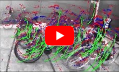
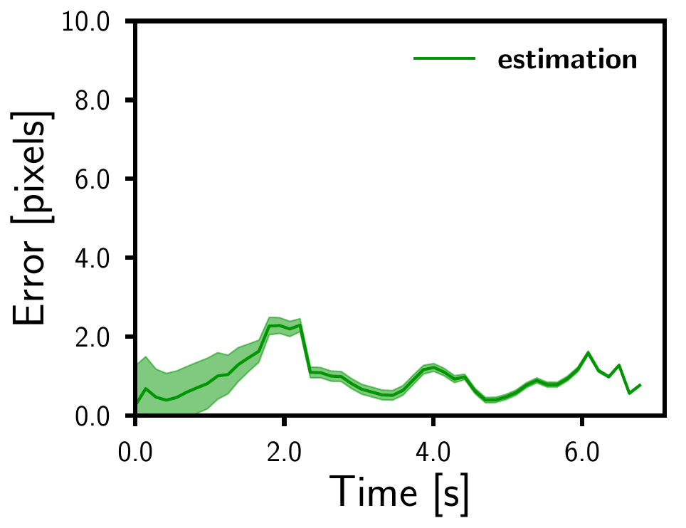
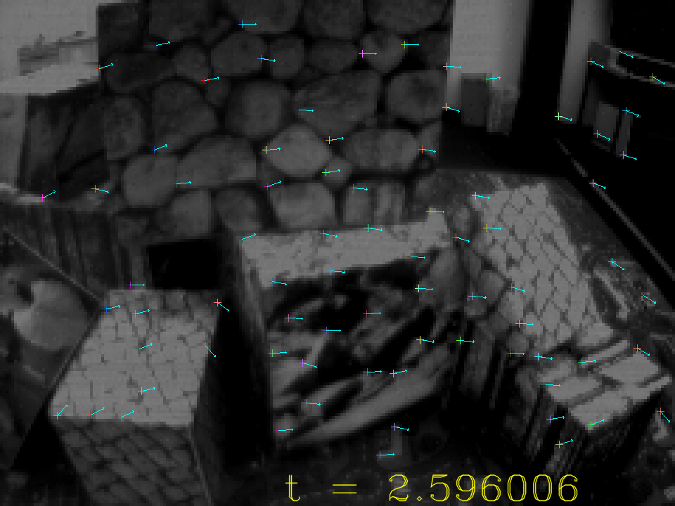

# EKLT: Asynchronous, Photometric Feature Tracking using Events and Frames
[](https://youtu.be/ZyD1YPW1h4U)

This repository implements the work in the 2019 IJCV paper [**EKLT: Asynchronous, Photometric Feature Tracking using Events and Frames**](http://rpg.ifi.uzh.ch/docs/IJCV19_Gehrig.pdf) by Daniel Gehrig, [Henri Rebecq](http://henri.rebecq.fr), [Guillermo Gallego](http://www.guillermogallego.es), and [Davide Scaramuzza](http://rpg.ifi.uzh.ch/people_scaramuzza.html).

### Citation
A pdf of the paper is [available here](http://rpg.ifi.uzh.ch/docs/IJCV19_Gehrig.pdf). If you use any of this code, please cite this publication as follows:

```bibtex
@Article{Gehrig_2019_IJCV,
  author        = {Daniel Gehrig and Henri Rebecq and Guillermo Gallego and
                  Davide Scaramuzza},
  title         = {{EKLT}: Asynchronous, Photometric Feature Tracking using Events and Frames},
  journal       = "Int. J. Comput. Vis.",
  year          = 2019,
  month         = {August},
}
```
## Overview

EKLT works by leveraging the complementarity between events and frames for feature tracking. Using the events it manages to track in the blind-time between two frames. First features are extracted on the frames and then tracked using only the events. The tracker then produces asynchronous feature tracks with high temporal resolution. More 
details can be found in the [paper](http://rpg.ifi.uzh.ch/docs/IJCV19_Gehrig.pdf) and [video](https://youtu.be/ZyD1YPW1h4U).

## Installation

This code was tested on [ROS melodic](http://wiki.ros.org/melodic/Installation) and [ROS kinetic](http://wiki.ros.org/melodic/Installation).
Install [catkin tools](http://catkin-tools.readthedocs.org/en/latest/installing.html) and [vcstool](https://github.com/dirk-thomas/vcstool) if needed:

    sudo apt-get install python-catkin-tools python-vcstool

Create a new catkin workspace if needed:

    mkdir -p catkin_ws/src
    cd catkin_ws
    catkin config --init --mkdirs --extend /opt/ros/melodic  --cmake-args -DCMAKE_BUILD_TYPE=Release
    
Then clone the repo and all its dependencies using vcs-import
    
    cd src
    git clone git@github.com:uzh-rpg/rpg_eklt.git
    vcs-import < rpg_eklt/dependencies.yaml

Finally, build the project and then source the workspace
    
    catkin build eklt
    source ~/catkin_ws/devel/setup.bash
    
## Running Example

Download [boxes_6dof](http://rpg.ifi.uzh.ch/datasets/davis/boxes_6dof.bag) from the [Event Camera Dataset](http://rpg.ifi.uzh.ch/davis_data.html) which was recorded using the [DVS ROS driver](https://github.com/uzh-rpg/rpg_dvs_ros) into a new directory

    cd /tmp/
    wget http://rpg.ifi.uzh.ch/datasets/eklt_example.zip
    unzip eklt_example.zip
    rm eklt_example.zip
    
Run EKLT with the following command:
    
    roslaunch eklt eklt.launch tracks_file_txt:=/tmp/eklt_example/tracks.txt v:=1

In a separate terminal play the rosbag:
  
    rosbag play /tmp/eklt_example/boxes_6dof.bag

**Configuration parameters**: 
Configuration parameters for eklt can be viewed by running the following command in a sourced terminal:

    rosrun eklt eklt_node --help

The individual parameters can be changed in `config/eklt.conf`. In particular, the parameter `min_corners` has been set to 0 which makes it such that no new features are initialized after the first image. This configuration was used in the paper. However, for continuous tracking you can set this value higher (50 is a good number).
Additional optional parameters can be set through the launch file `eklt.launch`:

* `v:=1` verbosity level of `VLOG` from the `glog` library
* `bag:=/path/to.bag`: path to the bag which will be used to perform evalution
* `tracks_file_txt:=/path/to/file.txt`: path to output file where feature tracks will be stored.

The tracks file contains all of the information necessary to reconstruct feature tracks. The feature tracks are stored in the following format:

|feature id| timestamp          | x     | y     |
|:--------:|:------------------:|:-----:|:-----:|
|0         |1468940293.922985274|187.032|132.671|
|2         |1468940293.958816290|204.603|105.36 |
|1         |1468940293.957388878|222.378|104.176|
|0         |1468940293.964686394|223.596|19.1384|
|1         |1468940293.960546732|182.122|52.1019|
|2         |1468940293.960608244|172.227|47.1469|

These feature tracks can be used directly for evaluation with [this feature tracking analysis package](https://github.com/uzh-rpg/rpg_feature_tracking_analysis). First clone the repo into your workspace 
    
    cd ~/catkin_ws/src
    git clone git@github.com:uzh-rpg/rpg_feature_tracking_analysis.git
 
 and run the following command

    python ~/catkin_ws/src/rpg_feature_tracking_analysis/evaluate_tracks.py --error_threshold 10 --tracker_type KLT --file /tmp/eklt_example/tracks.txt --dataset /tmp/eklt_example/dataset.yaml --root /tmp/eklt_example/ --plot_errors

A preview of the output (stored in `/tmp/eklt_example/results/errors.pdf`) is shown below.



## Visualization

When running the example a visualization of the feature tracks is publisher to the topic `/feature_tracks`



The visualization shows the features projected on to the current frames together with their flow angle estimate (blue arrow). Changing the flags `display_features`, `display_feature_id` and `display_feature_patches` toggle the display of the features, feature ids and feature patches respectively.

## Additional Resources on Event Cameras

* [Event-based Vision Survey](http://rpg.ifi.uzh.ch/docs/EventVisionSurvey.pdf)
* [List of Event-based Vision Resources](https://github.com/uzh-rpg/event-based_vision_resources)
* [Event Camera Dataset](http://rpg.ifi.uzh.ch/davis_data.html)
* [Event Camera Simulator](http://rpg.ifi.uzh.ch/esim)
* [RPG research page on Event Cameras](http://rpg.ifi.uzh.ch/research_dvs.html)
* [EKLT Conference paper, ECCV'18](http://rpg.ifi.uzh.ch/docs/ECCV18_Gehrig.pdf)
